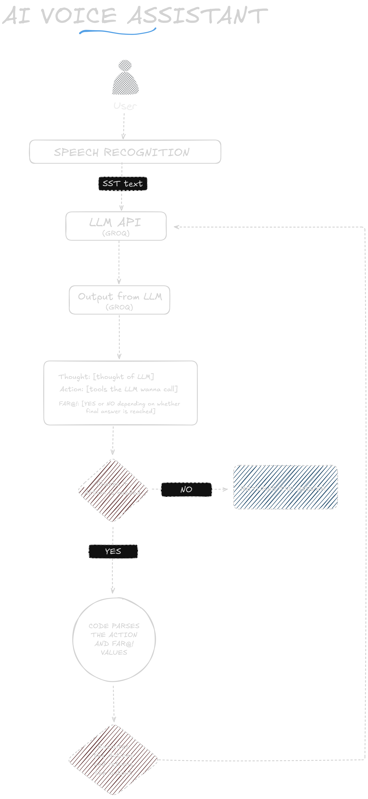

## This is an implementation of a AI-based Voice assistant made entirely in Python including the UI!
## This was a simple project so it didn't need to be split into multiple files.
# Tech stack:
- Groq (for the LLM)
- Streamlit library (For UI)
- Duckduckgo Search library (for search capabilities of the AI)
- gTTS library (For TTS)
- speech_recognition library (well,for speech recognition)
# Flow Diagram

